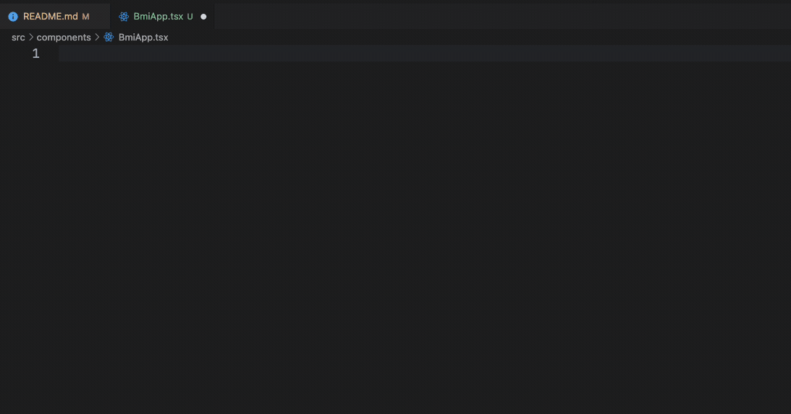
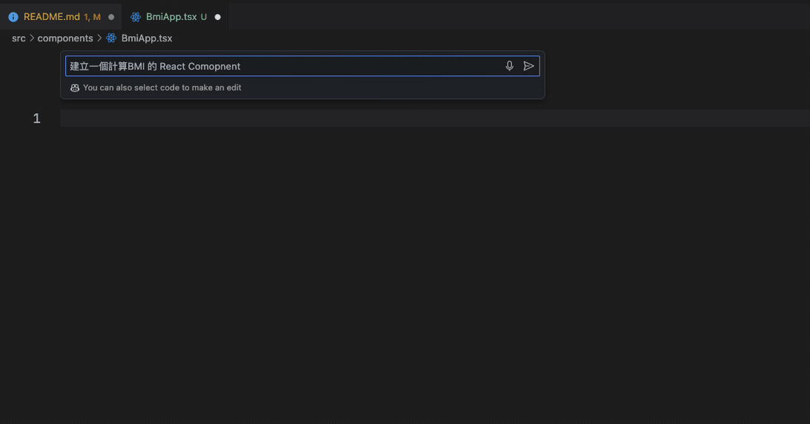
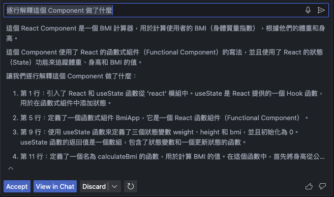
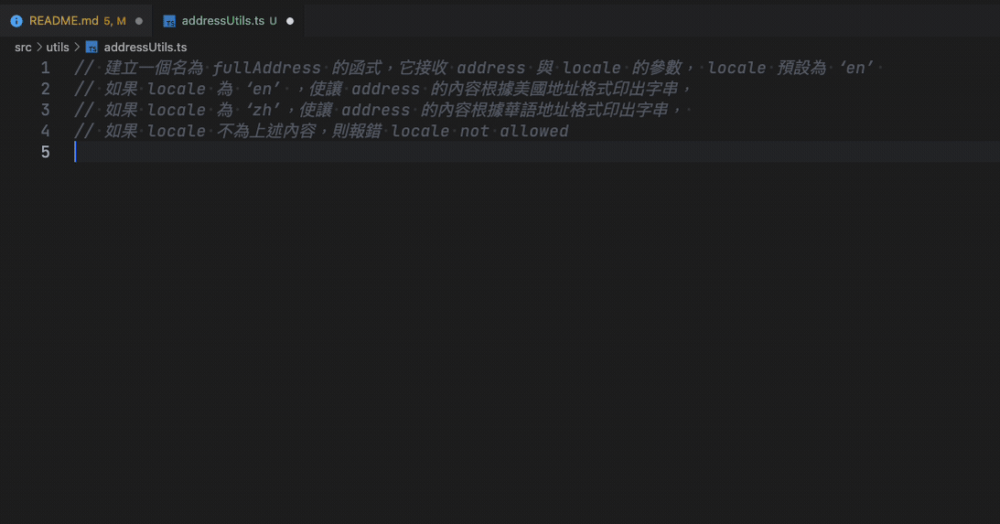
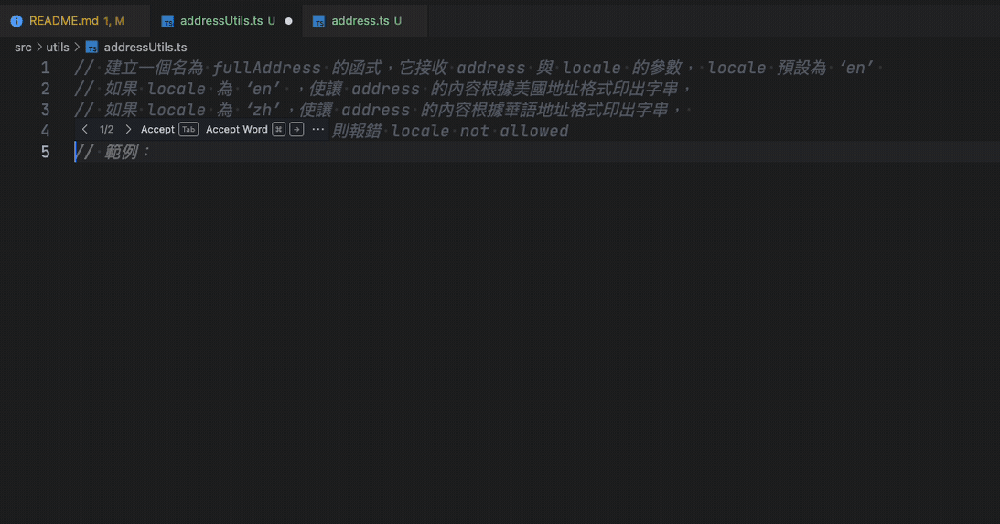
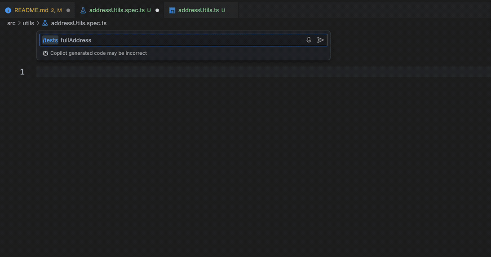

# GitHub Copilot Demo repo

這是一個 GitHub Copilot 的 Demo repo，由於我懶得搞環境，所以直接用 [`create-next-app`](https://github.com/vercel/next.js/tree/canary/packages/create-next-app) 起了一個[Next.js](https://nextjs.org/) 專案

## 範例一：建立 BMI 應用程式

### Attempt 1：直接用輸入後用 Tab 取得建議

在 `src/components/BmiApp.tsx` 直接輸入 `const BmiApp =`，然後等待建議：


### Attempt 2：使用 `cmd + I` 輸入你需求 (Prompt)，產生程式碼

輸入 `建立一個計算 BMI 的 react component`


### Attempt 3：使用 `cmd + I` 輸入你需求 (Prompt)，解釋程式碼

1. 選擇程式碼後， 使用 `cmd + I`，輸入`逐行解釋這個 Component 做了什麼`
   

## 範例二：建立方法並進行測試

### Attempt 1：直接用輸入後用 Tab 取得建議

1. VSCode 只開啟 `src/utils/addressUtils.ts`
2. 輸入以下註解在開頭

```javascript
// 建立一個名為 fullAddress 的函式，它接收 address 與 locale 的參數， locale 預設為 ‘en’
// 如果 locale 為 ‘en’ ，使讓 address 的內容根據美國地址格式印出字串，
// 如果 locale 為 ‘zh’，使讓 address 的內容根據華語地址格式印出字串，
// 如果 locale 不為上述內容，則報錯 locale not allowed
```

3. 開始輸入 `const fullAddress`，並透過 Tab 取得結果



### Attempt 2：直接用輸入後用 Tab 取得建議

1. VSCode 同時開啟 `src/utils/addressUtils.ts` 與 `src/types/address.ts`
2. 重覆 Attempt 1 的步驟 2，3



### Attempt 3：產生測試

1. 開啟 `src/utils/addressUtils.spec.ts`
2. 使用 `cmd + I` 輸入 `/tests fullAddress`



### Attempt 4：產生測試 2

1. 開啟 `src/utils/addressUtils.spec.ts`
2. 使用 `cmd + I` 輸入 `/tests fullAddress`


## Getting Started

```bash
npm run dev
# or
yarn dev
# or
pnpm dev
# or
bun dev
```

Open [http://localhost:3000](http://localhost:3000) with your browser to see the result.
